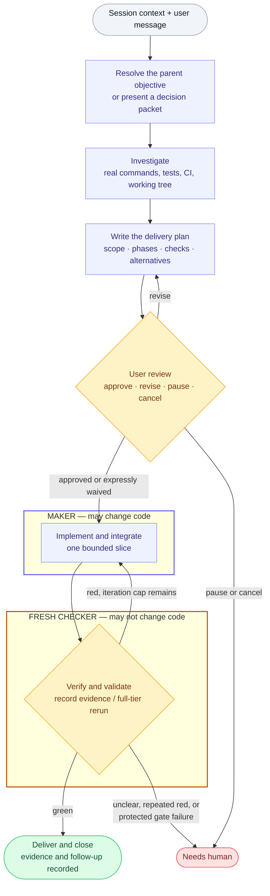

# writing-goals

**Give Claude Code and Codex a finish line they can prove.**

[](https://github.com/iliaim/writing-goals/actions/workflows/ci.yml)
[](LICENSE)
[](#platform-support)
[](#build-and-install)

`writing-goals` turns open-ended agent work into verifiable contracts: a lightweight persisted
contract for normal interactive work, and a protected plan only for unattended or genuinely independent multi-slice
work. The platform-neutral core method currently ships tested Claude Code and Codex adapters.

> [!IMPORTANT]
> **The maker does not certify its own completion.** Every contract records an exact command and
> observed result; full-tier work additionally requires a fresh checker to rerun it.

**New here?** [Install guide](docs/quickstart.md) · [Worked example](#worked-example) ·
[Security model](docs/security-model.md)

## How it works

A lightweight contract for ordinary work; a protected host workflow for unattended or genuinely
independently executable multi-slice work.



In text: resolve the outcome from the session, investigate the real repository, and present one
reviewable end-to-end delivery plan before implementation. After approval (or an explicit review
waiver for a direct task), the maker implements bounded slices, then records exact verification and
validation evidence before authorized delivery and closure. A reviewer may rerun checks when
proportionate; a full-tier checker must rerun them. Repeated red or an unclear decision stops for a
human, while full-tier hosts enforce a protected iteration cap.

The separation is the point. A maker can announce success, but the announcement never advances the
goal — only a rerun of the pre-written command does, and its observed result is what gets
recorded. Keep or link full output for failures and when it helps diagnosis.
Investigation and contract authoring come before either role is assigned, so they sit outside both
lanes.

## Why it exists

Ordinary prompts describe work, but they rarely define a trustworthy end state:

| Ordinary agent task | `writing-goals` contract |
|---|---|
| Completion is subjective | The acceptance command is chosen before implementation |
| The maker can announce that it is done | Exact observed evidence is recorded; full tier reruns it independently |
| Retries can stop early or continue indefinitely | Full-tier hosts enforce an iteration cap; normal work escalates repeated red |
| A green build may be treated as proof of behavior | Verification surfaces are ranked and weak proxies are named |
| A hook may be mistaken for containment | Trust boundaries and OS isolation remain explicit |

## Worked example

A vague request:

> Improve the authentication tests.

Becomes a bounded contract:

```text
Objective:     reject expired sessions with a regression-tested authentication change
Read first:    AGENTS.md, src/auth/, tests/auth/, existing authentication docs
Constraints:   only edit src/auth/; no new dependencies; do not edit, skip, narrow, or delete tests/auth/
Document:      update authentication docs if behavior or configuration is user-visible; otherwise record not applicable
Validate:      bash tests/auth/run.sh exits 0 and reports 12 passing scenarios; bash tests/run.sh exits 0
Checkpoints:   record the result and next gate after each bounded slice
Stop when:     both checks pass, or further work needs product input, a new dependency/ADR, or an irreversible action
```

The checker then returns evidence a third party can re-derive, not a summary:

```console
$ bash tests/auth/run.sh; echo "exit=$?"
...
PASS: 12 scenarios
exit=0
$ bash tests/run.sh; echo "exit=$?"
...
exit=0
```

The exact paths and commands must come from the target repository. An agent must investigate
rather than copy this example blindly. See [Examples](docs/examples.md) for complete patterns and
anti-patterns.

## Quick start

Build a portable bundle from a source checkout, then run its local copy installer:

```bash
git clone https://github.com/iliaim/writing-goals.git
cd writing-goals

mkdir -p dist
bash scripts/build-bundles.sh dist/writing-goals
bash dist/writing-goals/install.sh codex
# or
bash dist/writing-goals/install.sh claude
```

Then invoke it in either host:

| Host | Invoke |
|---|---|
| Claude Code | `/writing-goals Turn this migration into a bounded, verifiable goal.` |
| Codex | `$writing-goals Turn this migration into a bounded, verifiable goal.` |

The Codex `/skills` picker and description-based invocation are also supported. Start with the
[Quick start](docs/quickstart.md) for installation, updating, uninstalling, and a first real
request.

## When to use it

| Use a goal when | Skip it when |
|---|---|
| Work is multi-turn or will run unattended | A small one-shot edit is one where a goal adds more coordination than value |
| Completion has an observable end state worth enforcing | The desired outcome is still unknown and the work is exploratory |
| A migration, refactor, or feature splits into verifiable slices | There is no meaningful verification surface |
| Another agent or deterministic process must independently confirm the result | An irreversible decision, production change, or external send lacks explicit human authorization |

> [!WARNING]
> This repository is not a sandbox, general scheduler, autonomous DAG runner, or substitute for
> product decisions. Its Codex adapter includes one bounded foreground continuation supervisor for
> an already-approved protected run; it does not install a daemon, cron service, or recovery
> service. The host remains responsible for the sandbox, protected authority, and restart handling.

## The delivery path

1. **Triage** whether a goal is useful and resolve its parent outcome from session context.
2. **Investigate** repository guidance, implementation, tests, CI, and the working tree.
3. **Plan and review** the outcome, scope, phases, evidence, risks, and delivery closure before
   implementation.
4. **Implement and integrate** bounded slices only after the user approves the plan, unless a
   direct task has an explicit review waiver.
5. **Verify and validate** the stated criteria and the underlying user need.
6. **Deliver and close** with authorized handoff or publication, residual risks, and durable
   evidence.
7. **Apply autonomy by blast radius**, recording reversible choices and stopping for external or
   irreversible actions.

[`shared/method.md`](shared/method.md) is the canonical policy. The README and guides summarize
reader journeys and link to it; they do not replace it.

## Execution and state boundaries

Execution follows the canonical [Workflow contract](shared/workflow.md): each protected
checkpoint is verified before checkpoint-then-continue proceeds to the recorded successor.
There is no parallel continuation path.

| Boundary | What is true today |
|---|---|
| Commits | Approved execution may make **automatic local commits** |
| Durability | The v1 boundary is that all v1 state remains local; this accepts the single-machine risk rather than claiming durable recovery |
| External actions | One post-G13 human external gate is the sole gate for external push, pull request, merge, release, or deploy; it is not a mid-plan pause |
| Collaboration | GitHub Issues are a future, non-authoritative collaboration projection; Projects share that boundary |

The Goal Ledger domain contains immutable Goal definitions and protected lifecycle records. Local
plan and evidence artifacts are untrusted and cannot become lifecycle authority.

## Platform support

| Capability | Claude Code | Codex |
|---|---|---|
| Skill invocation | `/writing-goals` | `$writing-goals`, `/skills`, or description match |
| Non-interactive entrypoint | `claude -p` | `codex exec` |
| Project Stop-hook location | `.claude/settings.json` | `.codex/hooks.json` or `.codex/config.toml` |
| Repository root supplied by | `CLAUDE_PROJECT_DIR` | Hook input `cwd` |
| Shipped adapter | [`claude/SKILL.md`](claude/SKILL.md) | [`codex/SKILL.md`](codex/SKILL.md) |

Platform hook contracts change over time. Adapter-specific claims cite current official
documentation and are covered by repository documentation contracts.

## Build and install

Requirements: Bash 3.2 or newer for the installer, gates, and contract tests; `jq` for either
lifecycle gate; and `shasum` or `sha256sum` for verification-surface hashing. No language package
manager is required.

The bundle builder creates a deterministic, self-contained, symlink-free copy. Build it into an
otherwise absent output directory, then run the installer shipped inside that bundle:

```bash
mkdir -p dist
bash scripts/build-bundles.sh dist/writing-goals
bash dist/writing-goals/install.sh claude
bash dist/writing-goals/install.sh codex
# or preflight and install both transactionally:
bash dist/writing-goals/install.sh all
```

Installation uses compensated rollback, not crash-safe storage: `SIGKILL`, power loss, and
unsupported concurrent changes remain outside the installer contract. This applies to every
selection, not only `all`.

<details>
<summary><b>Install targets, collision rules, update, and local refresh</b></summary>

Claude is installed at `~/.claude/skills/writing-goals`; Codex at
`${CODEX_HOME:-$HOME/.codex}/skills/writing-goals`. A normal install refuses an occupied target
unless it is an identical, symlink-free copy from that bundle; it never provides a force-overwrite
mode. `all` preflights every target before changing any of them and restores prior states if a
handled installation command fails.

For a routine local refresh of both platforms, run:

```bash
git pull --ff-only
bash scripts/refresh-local.sh --install all
```

Check before updating with:

```bash
bash scripts/refresh-local.sh --status
bash scripts/refresh-local.sh --check-updates
```

`--status` is offline and shows the source plus installed Claude/Codex version and revision.
`--check-updates` explicitly contacts the configured Git upstream and reports whether the source is
behind, ahead, current, or diverged; it never pulls or installs. The update command remains an
explicit human-controlled Git action. The refresh command then runs the
contract suite, builds a new bundle, and saves only the replaced writing-goals targets under
`.archive/writing-goals/` inside this repository before installing. Restart Codex and Claude Code afterward. The
explicit `--install` flag is required; the command never updates in the background or touches
unrelated skills and agents.

</details>

## Deterministic gate

The gate is optional for interactive goal writing and required for every full-tier run. It turns
the acceptance command into a Stop-hook decision with three normal outcomes:

| Gate result | The hook emits | What happens next |
|---|---|---|
| Green | nothing, and exits `0` | The agent may stop; attempt state is cleared |
| Red, below the cap | `{"decision":"block","reason":...}` | One more bounded iteration is requested |
| Red at the cap, or invalid configuration or state | `{"continue":false,"stopReason":...}` | Terminal needs-human outcome |

Before those three, the adapter fails closed on its own preconditions: a missing `jq` or unparseable
hook input exits `2` with a message on standard error and no JSON, because the terminal payload is
itself built with `jq`.

Failing command output is stored in a session-keyed, mode-0600 state log rather than returned to
the model.

Copy the platform script into the target repository, make it executable, and configure all five
inputs in the environment that launches the agent:

```bash
export GATE_CMD='bash tests/run.sh'       # trusted, deterministic, non-mutating
export GOAL_GATE_CAP=6                    # explicit positive base-10 integer
export GATE_SURFACE='tests/*.sh'          # mandatory repo-relative shell glob/list
export GATE_AUTHORITY='/protected/goal-authority'
export GATE_PREFLIGHT_RECORD="$GATE_AUTHORITY/preflight.env"
```

`GATE_CMD` is evaluated as shell code, so it is a trusted configuration boundary, not untrusted
input. `GATE_SURFACE` uses whitespace-separated shell words and cannot represent filenames
containing whitespace. Every expansion must resolve to a regular file.

> [!WARNING]
> A full-tier host establishes and protects the green preflight receipt before maker work. The gate
> requires a mode-0600 `GATE_PREFLIGHT_RECORD` inside `GATE_AUTHORITY`, validates its bound digest,
> and rejects a missing or mismatched surface. The gate never accepts a first post-edit invocation as
> a baseline. Keeping gate state outside the repository is not sufficient by itself; sandbox
> permissions must prevent the maker from altering it.

<details>
<summary><b>Register the Stop hook in Claude Code</b></summary>

```bash
mkdir -p .claude/hooks
cp /path/to/writing-goals/assets/gate.claude.sh .claude/hooks/
chmod +x .claude/hooks/gate.claude.sh
```

Register the project Stop hook in `.claude/settings.json`:

```json
{
  "hooks": {
    "Stop": [{
      "hooks": [{
        "type": "command",
        "command": "$CLAUDE_PROJECT_DIR/.claude/hooks/gate.claude.sh"
      }]
    }]
  }
}
```

Claude normally overrides a Stop hook after eight consecutive blocks without progress, so keep
`GOAL_GATE_CAP <= 8` unless `CLAUDE_CODE_STOP_HOOK_BLOCK_CAP` is deliberately raised to at least
the same value.

</details>

<details>
<summary><b>Register the Stop hook in Codex</b></summary>

```bash
mkdir -p .codex/hooks
cp /path/to/writing-goals/assets/gate.codex.sh .codex/hooks/
chmod +x .codex/hooks/gate.codex.sh
```

Register it with an absolute path in `.codex/hooks.json`, then review and trust the hook:

```json
{
  "hooks": {
    "Stop": [{
      "hooks": [{
        "type": "command",
        "command": "/absolute/path/to/repo/.codex/hooks/gate.codex.sh"
      }]
    }]
  }
}
```

</details>

Read [`shared/gates.md`](shared/gates.md) before using the lifecycle gate.

## Safety boundary

> [!CAUTION]
> The Stop hook and [`assets/deny-list.sh`](assets/deny-list.sh) are defense in depth for a
> cooperative agent's mistakes. They are **not a security boundary** and do not contain a hostile
> or prompt-injected process.

Unattended work requires an OS-level sandbox, least privilege, read-only mounts outside the
workspace, restricted egress, explicit authorized scope (and enforceable limits when available),
protected gate state, and a kill path. See the
[Security model](docs/security-model.md) and [`shared/autonomy.md`](shared/autonomy.md).

## Maintainer benchmark harness

> [!NOTE]
> This section is for maintainers of this repository. The harness under `benchmarks/` is local and
> unshipped; installing an adapter neither installs nor runs it.

<details>
<summary><b>Cohort ledger, execution, and aggregation</b></summary>

The repository includes a local, unshipped benchmark harness under `benchmarks/`. It compares a
frozen scenario across profiles while retaining separate worktrees, temporary homes, JSON event
logs, an immutable run manifest, and an independently executed scenario evaluator. Codex is the
only implemented adapter today; the profile schema separates `host`, `model`, and `workflow` so a
Claude adapter or an alternative workflow can be added without changing scenario or evaluator
contracts.

Before any run, prepare one explicit, tab-separated 12-row cohort ledger outside tracked content
(normally under `.archive/`). It freezes the cohort ID, base commit, profile/prompt/evaluator/adapter
hashes, three scenario IDs, both arms, two repetitions, the interleaved order `1` through `12`, a
per-run timeout from 1 to 3,600 seconds, and one operator-action code: `none`, `operator-aborted`, or
`environment-repaired`. A ledger is deliberately not generated automatically: its purpose is to
make the planned inputs and order reviewable before either arm starts.

Start with a safe dry run against one row in that ledger:

```bash
bash benchmarks/run.sh \
  --ledger .archive/benchmarks/cohort.tsv \
  --profile benchmarks/profiles/codex-control.conf \
  --scenario benchmarks/scenarios/refresh-status \
  --run-id control-smoke \
  --dry-run
```

`--execute` creates a retained local benchmark worktree beneath `.archive/benchmarks/` and invokes
`codex exec` with the profile's declared model. It requires a clean source checkout and stops an
agent that exceeds its ledger timeout; the retained result records a fixed disposition, acceptance,
stage, exit detail, and elapsed milliseconds. Runs are unattended (`approval_policy=never`) but
fixed to Codex's `workspace-write` sandbox: the harness does not expose a bypass or full-access
option. A worktree is not a security boundary, so use an OS-level sandbox for stronger containment.
Credentials are never retained in benchmark evidence; a caller may supply a regular
`WG_CODEX_AUTH_SOURCE` file, which is copied only to an ephemeral Codex home and deleted when the
run ends. Sensitive values from that JSON file are checked against the retained logs and worktree;
any match discards the entire run rather than retaining secret-bearing evidence.

After all 12 declared rows have terminal evidence, aggregate only that exact ledger and run root:

```bash
bash benchmarks/aggregate.sh \
  --ledger .archive/benchmarks/cohort.tsv \
  --run-root .archive/benchmarks
```

Aggregation rejects missing, duplicate, or mismatched evidence rather than guessing from the latest
directory. It reports independently verified acceptance, elapsed time, operator-action code,
paired outcome, and two-repeat consistency. Twelve runs are descriptive feasibility evidence, not
a statistically reliable claim that one workflow is better. The evaluators are separate post-agent
processes, but are not hidden from the candidate; the results are therefore not a protected
held-out evaluation.

The initial cohort uses only deterministic hard gates. A future scenario may add a task-specific
qualitative rubric only after its hard gate passes and a separately approved human calibration; it
cannot turn a failed run into a pass. An invalid pair, non-pass, or discordant paired acceptance is
an RCA trigger: retain one short evidence-linked note in `.archive/`, do not retry or change results
automatically, and seek separate authorization for any one-hypothesis follow-up.

</details>

## Verify this checkout

Run the same portable contract suite used by CI on macOS and Ubuntu:

```bash
bash tests/run.sh
```

CI also runs ShellCheck on Ubuntu.

## Documentation

| Guide | Read it for |
|---|---|
| [Quick start](docs/quickstart.md) | Install, invoke, update, and remove the source distribution |
| [Examples](docs/examples.md) | Well-formed contracts, anti-patterns, and evidence |
| [Security model](docs/security-model.md) | Threat model, boundaries, and operational controls |
| [Canonical method](shared/method.md) | The platform-neutral contract |
| [Goal authoring](shared/author-goal.md) | Anatomy and templates |
| [Deterministic gates](shared/gates.md) | Lifecycle verification |
| [Goal chaining](shared/chaining.md) | Shallow persisted DAGs |
| [Autonomy policy](shared/autonomy.md) | Action classes and unattended controls |
| [Workflow contract](shared/workflow.md) | Protected sequential activation and continuation |
| [Publication](shared/publication.md) | Local commits and the final external-action boundary |
| [As-built record](PLAN.md) | Architecture, compatibility, and design decisions |

<details>
<summary><b>Repository map</b></summary>

| Path | Purpose |
|---|---|
| [`shared/method.md`](shared/method.md) | Canonical platform-neutral method |
| [`shared/`](shared/) | Focused investigation, authoring, gate, chaining, autonomy, and mode references |
| [`claude/SKILL.md`](claude/SKILL.md) | Claude Code adapter |
| [`codex/SKILL.md`](codex/SKILL.md) | Codex adapter and metadata |
| [`assets/`](assets/) | Gate adapters, pre-use policy, and goal template |
| [`tests/`](tests/) | Portable installer, gate, policy, and documentation contracts |
| [`scripts/build-bundles.sh`](scripts/build-bundles.sh) | Deterministic portable bundle builder |
| [`scripts/refresh-local.sh`](scripts/refresh-local.sh) | Explicit, tested local refresh with backups |
| [`benchmarks/`](benchmarks/) | Maintainer-only reusable, provider-neutral benchmark harness |
| [`install.sh`](install.sh) | Bundle-local copy installer |

</details>

## Project policies

[Contributing](CONTRIBUTING.md) · [Security](SECURITY.md) · [Support](SUPPORT.md) ·
[Code of Conduct](CODE_OF_CONDUCT.md) · [Changelog](CHANGELOG.md) · [MIT License](LICENSE)

Maintained by [iliaim](https://github.com/iliaim). Use the structured
[issue forms](https://github.com/iliaim/writing-goals/issues/new/choose) for public documentation,
compatibility, bug, and feature reports. Follow the [Code of Conduct](CODE_OF_CONDUCT.md) and
GitHub's [private abuse-reporting route](https://docs.github.com/en/communities/maintaining-your-safety-on-github/reporting-abuse-or-spam)
for abusive GitHub content that requires private handling. Report security vulnerabilities through
[GitHub private vulnerability reporting](https://github.com/iliaim/writing-goals/security/advisories/new).
