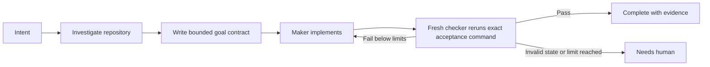

# writing-goals

**Give Claude Code and Codex a finish line they can prove.**

[](https://github.com/iliaim/writing-goals/actions/workflows/ci.yml)
[](LICENSE)

`writing-goals` turns open-ended agent work into bounded goal contracts with exact acceptance
checks, independent verification, and explicit limits on retries, time, and cost. The core method
is platform-neutral; this repository currently ships tested Claude Code and Codex adapters.

The core rule is simple: **the maker does not certify its own completion.** A fresh checker must
be able to rerun the same acceptance command and reach the same result.

## Why it exists

Ordinary prompts describe work, but they rarely define a trustworthy end state:

| Ordinary agent task | `writing-goals` contract |
|---|---|
| Completion is subjective | The acceptance command is chosen before implementation |
| The maker can announce that it is done | A fresh checker reruns the evidence |
| Retries can stop early or continue indefinitely | Success, failure, iteration, time, and cost stops are explicit |
| A green build may be treated as proof of behavior | Verification surfaces are ranked and weak proxies are named |
| A hook may be mistaken for containment | Trust boundaries and OS isolation remain explicit |



In text: investigate the real repository, define one observable outcome and its check, let the
maker implement it, then have a fresh checker rerun the exact command. A failure may trigger a
bounded retry; invalid state or an exhausted limit stops for a human.

## Worked example

A vague request:

> Improve the authentication tests.

Becomes a bounded contract:

```text
Done when:     bash tests/auth/run.sh exits 0 and reports 12 passing scenarios
Also green:    bash tests/run.sh exits 0
Scope:         only edit src/auth/; do not edit, skip, or delete tests/auth/
Verification:  paste the raw output from both commands and each exit code
Stop:          success = both checks pass
               failure = the auth check fails twice without progress
               max_iterations = 4
               max_cost = USD 5
               max_wall_clock = 45 minutes
```

The exact paths and commands must come from the target repository. An agent must investigate
rather than copy this example blindly. See [Examples](docs/examples.md) for complete patterns and
anti-patterns.

## Quick start

Build a portable bundle from a source checkout, then run its local copy installer:

```bash
git clone https://github.com/iliaim/writing-goals.git
cd writing-goals

mkdir -p dist
bash scripts/build-bundles.sh dist/writing-goals
bash dist/writing-goals/install.sh codex
# or
bash dist/writing-goals/install.sh claude
```

In Codex:

```text
$writing-goals Turn this migration into a bounded, verifiable goal.
```

In Claude Code:

```text
/writing-goals Turn this migration into a bounded, verifiable goal.
```

The Codex `/skills` picker and description-based invocation are also supported. Start with the
[Quick start](docs/quickstart.md) for installation, updating, uninstalling, and a first real
request.

## When to use it

Use a goal when:

- work is multi-turn or will run unattended;
- completion has an observable end state worth enforcing;
- a migration, refactor, or feature can be split into verifiable slices; or
- another agent or deterministic process must independently confirm the result.

Skip it for:

- a small one-shot edit where a goal adds more coordination than value;
- exploratory work whose desired outcome is still unknown;
- work with no meaningful verification surface; or
- irreversible decisions, production changes, or external sends that lack explicit human
  authorization.

This repository is not a sandbox, scheduler, autonomous DAG runner, or substitute for product
decisions. The host owns the bounded, sequential execution protocol; public documentation does
not create a separate continuation mechanism. Separate continuation mechanisms are out of scope.

## How it works

The canonical method has six stages:

1. **Triage** whether a goal is useful.
2. **Investigate** repository guidance, implementation, tests, CI, and the working tree.
3. **Author** one observable slice with scope, evidence, inherited checks, and complete stop rules.
4. **Gate** unattended work with a trusted, deterministic, non-mutating checker.
5. **Chain** only an approved larger specification into a shallow, resumable dependency graph.
6. **Apply autonomy by blast radius**, recording reversible choices and stopping for external or
   irreversible actions.

[`shared/method.md`](shared/method.md) is the canonical policy. The README and guides summarize
reader journeys and link to it; they do not replace it.

Execution follows the canonical [Workflow contract](shared/workflow.md): each protected
checkpoint is verified before checkpoint-then-continue proceeds to the recorded successor.
There is no parallel continuation path.

Approved execution may make **automatic local commits**. The v1 boundary is that all v1 state remains local; this accepts
the single-machine risk rather than claiming durable recovery. GitHub Issues are a future, non-authoritative collaboration projection; Projects share that boundary. One post-G13 human external gate is the sole gate for external push, pull request, merge, release, or deploy; it is not a mid-plan pause.

The Goal Ledger domain contains immutable Goal definitions and protected lifecycle records. Local
plan and evidence artifacts are untrusted and cannot become lifecycle authority.

## Platform support

| Capability | Claude Code | Codex |
|---|---|---|
| Skill invocation | `/writing-goals` | `$writing-goals`, `/skills`, or description match |
| Non-interactive entrypoint | `claude -p` | `codex exec` |
| Project Stop-hook location | `.claude/settings.json` | `.codex/hooks.json` or `.codex/config.toml` |
| Repository root supplied by | `CLAUDE_PROJECT_DIR` | Hook input `cwd` |
| Shipped adapter | [`claude/SKILL.md`](claude/SKILL.md) | [`codex/SKILL.md`](codex/SKILL.md) |

Platform hook contracts change over time. Adapter-specific claims cite current official
documentation and are covered by repository documentation contracts.

## Requirements

- Bash 3.2 or newer for the installer, gates, and contract tests
- `jq` for either lifecycle gate
- `shasum` or `sha256sum` for verification-surface hashing

No language package manager is required.

## Build and install

The bundle builder creates a deterministic, self-contained, symlink-free copy. Build it into an
otherwise absent output directory, then run the installer shipped inside that bundle:

```bash
mkdir -p dist
bash scripts/build-bundles.sh dist/writing-goals
bash dist/writing-goals/install.sh claude
bash dist/writing-goals/install.sh codex
# or preflight and install both transactionally:
bash dist/writing-goals/install.sh all
```

Claude is installed at `~/.claude/skills/writing-goals`; Codex at
`${CODEX_HOME:-$HOME/.codex}/skills/writing-goals`. A normal install refuses an occupied target
unless it is an identical, symlink-free copy from that bundle; it never provides a force-overwrite
mode. `all` preflights every target before changing any of them and restores prior states if a
handled installation command fails.

This is compensated rollback, not crash-safe storage: `SIGKILL`, power loss, and unsupported
concurrent changes remain outside the installer contract.

For a routine local refresh of both platforms, run:

```bash
git pull --ff-only
bash scripts/refresh-local.sh --install all
```

The update command is an explicit human-controlled Git action. The refresh command then runs the
contract suite, builds a new bundle, and saves only the replaced writing-goals targets under
`~/.writing-goals-backups/` before installing. Restart Codex and Claude Code afterward. The
explicit `--install` flag is required; the command never updates in the background or touches
unrelated skills and agents.

## Deterministic gate

The gate is optional for interactive goal writing and required for unattended execution. Copy the
platform script into the target repository, make it executable, and configure all three inputs in
the environment that launches the agent:

```bash
export GATE_CMD='bash tests/run.sh'       # trusted, deterministic, non-mutating
export GOAL_GATE_CAP=6                    # explicit positive base-10 integer
export GATE_SURFACE='tests/*.sh'          # mandatory repo-relative shell glob/list
```

`GATE_CMD` is evaluated as shell code, so it is a trusted configuration boundary, not untrusted
input. `GATE_SURFACE` uses whitespace-separated shell words and cannot represent filenames
containing whitespace. Every expansion must resolve to a regular file.

The stored digest only detects changes after a **trusted baseline** exists. The currently
supported setup makes the complete verification surface read-only to the maker before work
starts. A trusted orchestrator can establish the first digest only by invoking the hook with the
exact same session payload and state key before maker edits. The scripts have no prime-only
interface, so manual or pre-session priming is not reliable. Keeping gate state outside the
repository is not sufficient by itself; sandbox permissions must prevent the maker from altering
it.

For Claude Code:

```bash
mkdir -p .claude/hooks
cp /path/to/writing-goals/assets/gate.claude.sh .claude/hooks/
chmod +x .claude/hooks/gate.claude.sh
```

Register the project Stop hook in `.claude/settings.json`:

```json
{
  "hooks": {
    "Stop": [{
      "hooks": [{
        "type": "command",
        "command": "$CLAUDE_PROJECT_DIR/.claude/hooks/gate.claude.sh"
      }]
    }]
  }
}
```

Claude normally overrides a Stop hook after eight consecutive blocks without progress, so keep
`GOAL_GATE_CAP <= 8` unless `CLAUDE_CODE_STOP_HOOK_BLOCK_CAP` is deliberately raised to at least
the same value.

For Codex:

```bash
mkdir -p .codex/hooks
cp /path/to/writing-goals/assets/gate.codex.sh .codex/hooks/
chmod +x .codex/hooks/gate.codex.sh
```

Register it with an absolute path in `.codex/hooks.json`, then review and trust the hook:

```json
{
  "hooks": {
    "Stop": [{
      "hooks": [{
        "type": "command",
        "command": "/absolute/path/to/repo/.codex/hooks/gate.codex.sh"
      }]
    }]
  }
}
```

On a red check below the cap, either adapter emits `{"decision":"block",...}` and requests another
iteration. A green check exits cleanly with no JSON. Invalid configuration or state, and a red
check at the cap, are terminal needs-human outcomes emitted as
`{"continue":false,"stopReason":...}`. Failing command output is stored in a session-keyed,
mode-0600 state log rather than returned to the model.

Read [`shared/gates.md`](shared/gates.md) before using the lifecycle gate.

## Safety boundary

The Stop hook and [`assets/deny-list.sh`](assets/deny-list.sh) are defense in depth for a
cooperative agent's mistakes. They are **not a security boundary** and do not contain a hostile
or prompt-injected process.

Unattended work requires an OS-level sandbox, least privilege, read-only mounts outside the
workspace, restricted egress, explicit budgets, protected gate state, and a kill path. See the
[Security model](docs/security-model.md) and [`shared/autonomy.md`](shared/autonomy.md).

## Documentation

- [Quick start](docs/quickstart.md) — install, invoke, update, and remove the source distribution
- [Examples](docs/examples.md) — well-formed contracts, anti-patterns, and evidence
- [Security model](docs/security-model.md) — threat model, boundaries, and operational controls
- [Canonical method](shared/method.md) — the platform-neutral contract
- [Goal authoring](shared/author-goal.md) — anatomy and templates
- [Deterministic gates](shared/gates.md) — lifecycle verification
- [Goal chaining](shared/chaining.md) — shallow persisted DAGs
- [Autonomy policy](shared/autonomy.md) — action classes and unattended controls
- [Workflow contract](shared/workflow.md) — protected sequential activation and continuation
- [Publication](shared/publication.md) — local commits and the final external-action boundary
- [As-built record](PLAN.md) — architecture, compatibility, and design decisions

## Repository map

| Path | Purpose |
|---|---|
| [`shared/method.md`](shared/method.md) | Canonical platform-neutral method |
| [`shared/`](shared/) | Focused investigation, authoring, gate, chaining, autonomy, and mode references |
| [`claude/SKILL.md`](claude/SKILL.md) | Claude Code adapter |
| [`codex/SKILL.md`](codex/SKILL.md) | Codex adapter and metadata |
| [`assets/`](assets/) | Gate adapters, pre-use policy, and goal template |
| [`tests/`](tests/) | Portable installer, gate, policy, and documentation contracts |
| [`scripts/build-bundles.sh`](scripts/build-bundles.sh) | Deterministic portable bundle builder |
| [`scripts/refresh-local.sh`](scripts/refresh-local.sh) | Explicit, tested local refresh with backups |
| [`install.sh`](install.sh) | Bundle-local copy installer |

## Verify this checkout

Run the same portable contract suite used by CI on macOS and Ubuntu:

```bash
bash tests/run.sh
```

CI also runs ShellCheck on Ubuntu.

## Project policies

- [Contributing](CONTRIBUTING.md)
- [Security](SECURITY.md)
- [Support](SUPPORT.md)
- [Code of Conduct](CODE_OF_CONDUCT.md)
- [Changelog](CHANGELOG.md)
- [MIT License](LICENSE)

Maintained by [iliaim](https://github.com/iliaim). Use the structured
[issue forms](https://github.com/iliaim/writing-goals/issues/new/choose) for public documentation,
compatibility, bug, and feature reports. Follow the [Code of Conduct](CODE_OF_CONDUCT.md) and
GitHub's [private abuse-reporting route](https://docs.github.com/en/communities/maintaining-your-safety-on-github/reporting-abuse-or-spam)
for abusive GitHub content that requires private handling. Report security vulnerabilities through
[GitHub private vulnerability reporting](https://github.com/iliaim/writing-goals/security/advisories/new).
